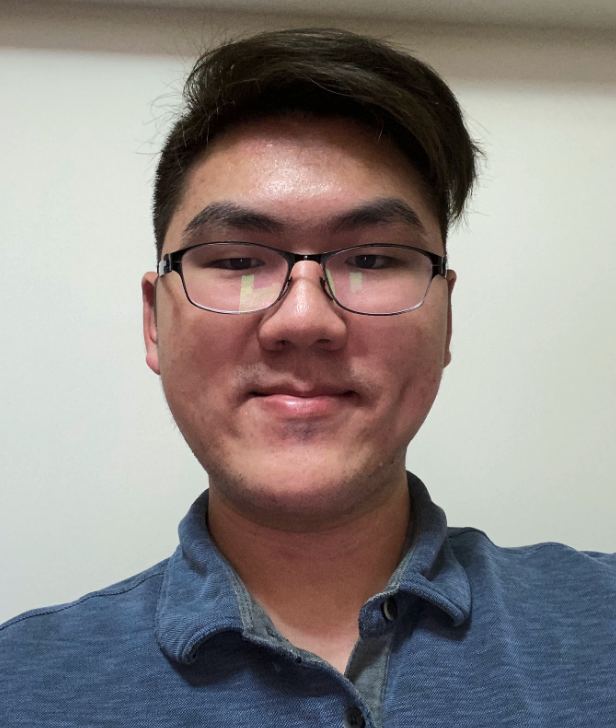

# Welcome to Vincent Tu's Home Page!!! :sunglasses: :sunglasses: :sunglasses:

If you want to check out my [repository](https://github.com/v2tu/v2tu.github.io) for more information on what I did with the user page, feel free to do so. In the future, I will add more to this repository. :smile: :smile:

## About Me

My name is Vincent Tu, and I am currently a 3rd year Math-CS student at University of California, San Diego. The reason I have chosen this major is because I personally **love _mathematics_ and also developed an interest in _computer science_**, hence I cam to this college to study the perfect major for me. 

### [My Weebly Website](https://vtubobamilktea.weebly.com/)

I have created a website with information about Boba Milk Tea in great detail, I encourage you guys to go check it out to learn more about the origins about Boba Milk Tea as well as some recommendation for Boba Milk Tea places to try it out based on my own personal opinion.

### Hobbies

Some things that I ~~like~~ love to do with my own free time:
 * Play Chess
 * Video Games 
   * League of Legends
   * Genshin Impact
   * Nintendo Switch games (Favorite: Xenoblade Chronicles 2)
 * Reading Manga/ Watch Anime 
 * Watching random YouTube Videos
 * ***sleeping***

### *Favorite Quotes*

Here is my ranking of my favorite quotes that I use to fuel my motivation to learn:
1. Albert Einstein:
  >A person who never made a mistake never tried anything new.

2. Walt Disney:
  >The best way to get started is to quit talking and begin doing.
  
3. Theodore Roosevelt:
  >Do what you can with all you have, wherever you are.
  
4. Confucius:
  >To see what is right and not do it is a lack of courage.
  
5. Thomas Edison:
  >Genius is one percent inspiration and ninety-nine percent perspiration.
  
### Goals That I Set

Here is my list of goals that I plan to achieve:
- [ ] Get an internship for the summer
- [ ] Start doing LeetCode Practice
- [ ] Start a project using Unreal Engine 4
- [X] Exercise more
